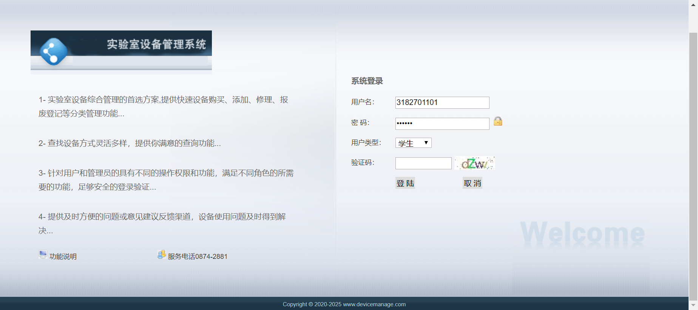
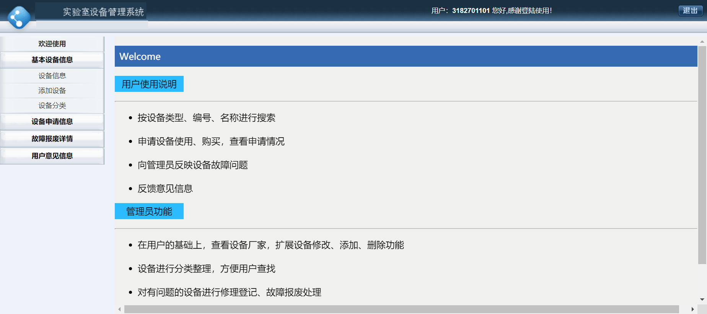
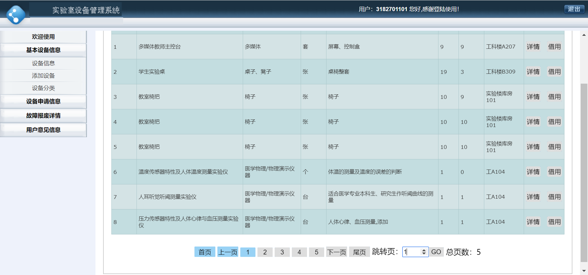
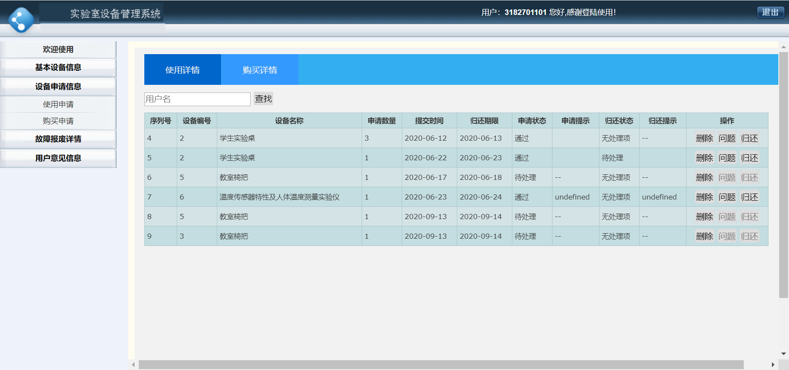
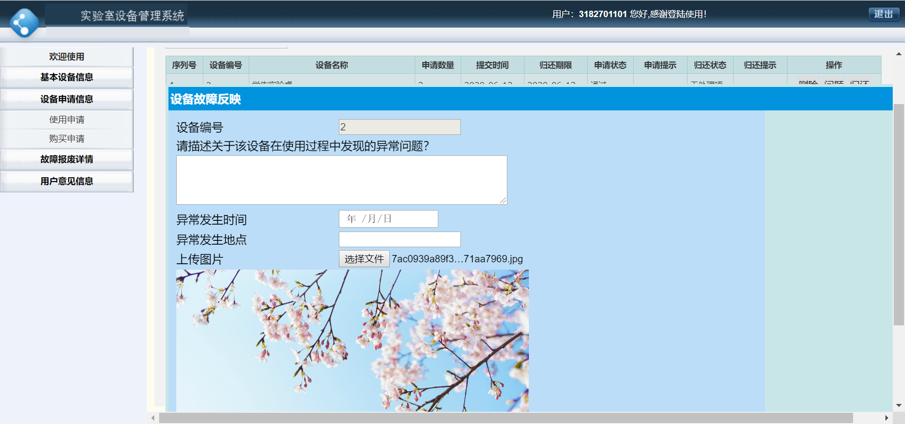
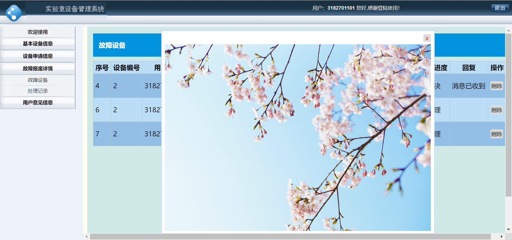
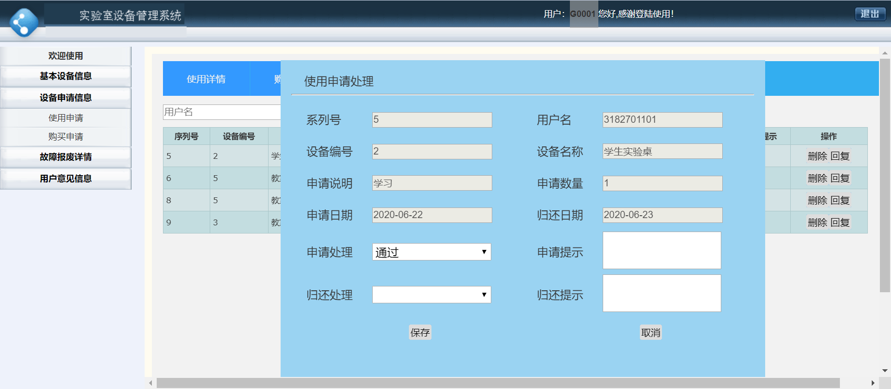
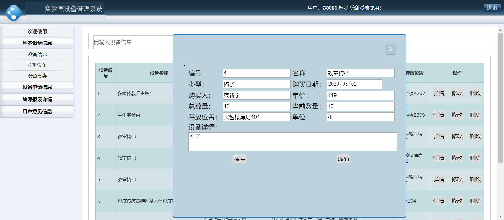
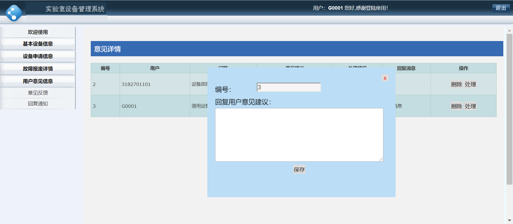

devicemanage简介

## 项目名称

实验室设备管理系统

## 开发目的

方便高效地实验室设备统一管理，除了实现基本的增删改查，还提供借用、归还、购买和问题反馈功能，可实现对实验室设备的基本业务的处理

本项目由本人负责开发完成，项目能保证正常运行，当然其中不免也会会有缺漏或不完善的地方

## 解决方案

1.后端Java框架使用**spring+springmvc+mybatis**

spring功能是实现参数参数注入，请求分发处理，对数据库操作进行事务控制，其中mybatis使用注解查询，整体上大部分使用xml配置，少部分使用注解

2.前端使用**HTML+javascript+css+jquery**

绝大部分请求使用ajax发送，页面动态响应内容由javascript动态生成，css样式大部分手工编写

3.数据库使用mysql-8.0

项目设计数据库是关键，这个项目里面添加了一些初始数据作为测试

## 项目特色

1.**批量数据分页查询的呈现和控制**

批量数据的分页查询颇费功夫，自己写了一个能实现分页查询的javascript直接对象，并设计了页面呈现的样式，这里有我本人的的帖子：[Javascript实现实现分页查询](https://blog.csdn.net/qq_43521551/article/details/106763914)

2.**页面布局和样式设计**

为了页面功能菜单项的不用点击就能出现，使用了鼠标移动监听；为了实现页面各个功能点击可切换，设计之初特地把每一个子功能拆开设计好再组合起来；为了不使用默认的弹窗提示，单独设计了一个动态定时自动消失的弹框提示

3.**项目开发管理的转变**

最初项目采用eclipse-jee开发，克服了eclipse开发工具很多的问题基本能够熟练但同时发现eclipse诸多的缺点，使用后来采用IDEA；最初使用传统的导jar包方式，后来整个项目在IDEA上使用maven管理来管理

4.**前后端分离的项目设计**

原本的项目采用jsp技术进行混合式开发，但往往难以维护，最终还是抛弃了jsp，对静态页面使用html

5.**安全控制的设计**

具有一定安全性，项目的静态页面的直接访问进行过滤器设计，未登录情况下无法直接访问；对发送的请求进行拦截器设计，请求以不同的后缀名区分哪些资源能够匿名访问，哪些必须通过会话中的登录验证才能访问

## 使用说明
1. 把项目导入idea2019，然后使用`devicemanage.sql`创建与该项目同名的数据库
2. 修改`xml`中关于数据库mysql连接的信息，先测试连数据库能够正常
3. 最简单的启动方式，可以选择使用命令`mvm tomcat7:run`启动tomcat便可访问，无需单独配置tomcat，因为使用的是`pom.xml`插件指定的的tomcat
4. 如果不使用上面mvn命令配置tomcat，那么这里可参考版本`tomcat9.0.22`，并tomcat配置页面配置访问路径：
```
#该路径如果要定义为其他，需要修改login.html中指定的全局的BASE_URL与后端一致，并且需要检查后端图片请求的路径
http://localhost:8080/devicemanage
```
5. 使用默认测试账号登录

```shell script
管理员账号
G0001
123456

用户账号
3182701101
123456
```
6. 项目这次已经更新了大部分bug以方便初学者学习，由于该项目比较基础简单，后面除非有必要才会再更新了


## 实现效果

### 1.登录首页



### 2.功能首页



### 3.分页效果



### 4.操作选项



### 5.图片上传



### 6.图片查看



### 7.管理员页面



### 8.管理员权限



### 9.意见反馈




